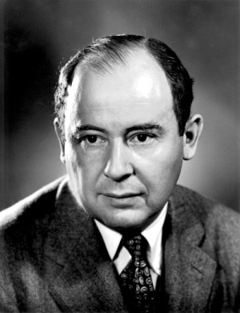
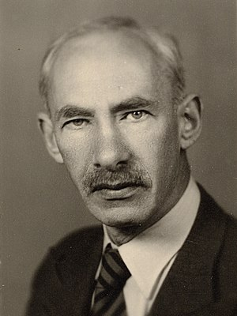

# Set theory :: Set theorist

Set theorists
- Georg Cantor
- Gotlib Frege
- Richard Dedekind
- Bertrand Russell
- Thoralf Skolem
- Ernst Zermelo
- Abraham Fraenkel
- John von Neumann
- Kurt Gödel
- Paul Bernays
- Paul Cohen
- Thomas Jech
- Willard Quine
- Lorenz Halbeisen
- Alfred Tarski
- John L. Kelley
- Anthony Morse
- Paul Halamos
- Alexander Grothendieck
- Burali
- Forti

Zermelo set theory
- Ernst Zermelo

ZF and ZFC set theory
- Ernst Zermelo
- Abraham Fraenkel

Von Neumann-Bernays-Gödel set theory
- John von Neumann
- Paul Bernays
- Kurt Gödel

Morse-Kelley set theory
- Anthony Morse
- John L. Kelley

Quine's New Foundations (NF)
- Willard Quine

Tarski-Grothendieck set theory
- Alfred Tarski
- Alexander Grothendieck

