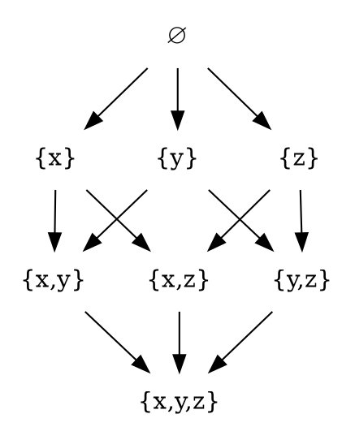

# Partially ordered set

https://en.wikipedia.org/wiki/Partially_ordered_set

A **partially ordered set (poset)** formalizes and generalizes the intuitive notion of an ordering of the elements of a set.

A poset consists of a carrier set endowed with a binary relation that indicates the precedence between the set elements, i.e. whether one element precedes another in the ordering. The relation itself is called a *partial order*.

The qualifier "partial" is used to indicate that not every pair of elements needs to be comparable. That is, there may be pairs of elements for which neither element precedes the other in the poset. Partial orders thus generalize total orders, in which any given pair of elements is comparable.

A familiar example of a poset (or rather, a partially ordered type) can be found in almost any programming language that implements the floating point numbers according to the IEEE 754 standard (which is practically always the case). The standard identifies the existence of a small set of the special values, including `NaN`, `Infinity`, `-Infinity`. Most of these special values, and particularly `NaN`, cannot be compared with floating-point numbers even though all the values have the same type. Interestingly, e.g. in JS, both the strict and loose comparison, `NaN === NaN` and `NaN == NaN`, return `False`, thereby also destroying the reflexive property, which, along with antisymmetry and transitivity, is the defining property of partial orders and posets.

Rust is very pedantic about this issue, introducing a separate class for partial orders, `PartialOrd`, in order to distinguish such types (`f32`, `f64`) from those that are totally ordered, `Ord` (`u32`, `i32`, `u64`, `i64`). Consistrntly, Rust also makes an effort to distiguish `Eq` from `PartialEq` (trait for equality comparisons which are partial equivalence relations). Haskell, on the other hand, does not, sporting only `Eq` and `Ord` type classes. Type classes have made their debut in Haskell, become popular and transplanted into other PLs. Rust had witnessed Haskell's implementation and, in the case of partial types, decided to introduce their partial counterparts (and I'm not sure if they make any significant difference; I can't say that I long for partial variants of `Ord` and `Eq` in Haskell).

## Informal definition

A partial order defines a notion of comparison. Two elements may be in any of 4 mutually exclusive relations with each other:
- `x < y`
- `x = y`
- `x > y`
- `x` and `y` are incomparable

## Hasse diagram

A poset can be visualized through its Hasse diagram, which depicts the ordering relation.

The *Hasse diagram* below presents an example of the partially ordered set: the set of all subsets, i.e. the powerset of `{x,y,z}` ordered by inclusion. Sets that are connected by an upward path, like `∅` and `{x,y}` are comparable, but `{x}` and `{y}` are not.

## Partial order relation
