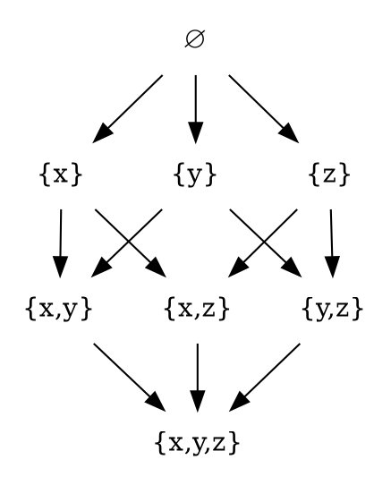

# Hasse diagram

https://en.wikipedia.org/wiki/Hasse_diagram

In order theory, a **Hasse diagram** is a type of mathematical diagram used to represent a *finite partially ordered set*, in the form of a drawing of its transitive reduction. Concretely, for a partially ordered set (S, ≤) one represents each element of S as a vertex in the plane and draws a line segment or curve that goes upward from x to y whenever y covers x (that is, whenever x < y and there is no z such that x < z < y). These curves may cross each other but must not touch any vertices other than their endpoints. Such a diagram, with labeled vertices, uniquely determines its partial order.

The diagrams are named after Helmut Hasse (1898–1979); according to Garrett Birkhoff (1948), they are so called because of the effective use Hasse made of them. However, Hasse was not the first to use these diagrams. One example that predates Hasse can be found in Henri Gustav Vogt (1895). Although Hasse diagrams were originally devised as a technique for making drawings of partially ordered sets by hand, they have more recently been created automatically using graph drawing techniques.

The phrase "Hasse diagram" may also refer to the transitive reduction as an abstract directed acyclic graph, independently of any drawing of that graph, but this usage is eschewed here

## Hasse diagram

A poset can be visualized through its Hasse diagram, which depicts the ordering relation.

The *Hasse diagram* below presents an example of the partially ordered set: the set of all subsets, i.e. the powerset of `{x,y,z}` ordered by inclusion. Sets that are connected by an upward path, like `∅` and `{x,y}` are comparable, but `{x}` and `{y}` are not.

