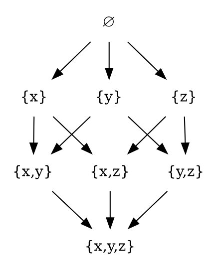

# Partially ordered set

https://en.wikipedia.org/wiki/Partially_ordered_set

A **partially ordered set**, also *poset*, formalizes and generalizes the intuitive concept of ordering the elements of a set.

A poset consists of a carrier set endowed with a binary relation that indicates the precedence between its elements (whether one element precedes another in that ordering). The relation itself is called a *partial order*.

However, being a partial (and not a total) order means that not every pair of elements is comparable; that is, there may be pairs of elements for which neither element precedes the other. Partial orders thus generalize total orders, in which every pair is comparable.

`x ⊰ y ⊱ z`
`x ≻ y ≺ z`
⊱
⫿

x precedes y under the relation, and 
suceed

## Topics

  1. Informal definition
  2. Partial order relation
    2.1 Non-strict partial order
    2.2 Strict partial order
    2.3 Correspondence of strict and non-strict partial order relations
    2.4 Dual orders
  3. Notation
  4. Examples
    4.1 Orders on the Cartesian product of partially ordered sets
    4.2 Sums of partially ordered sets
  5. Derived notions
    5.1 Extrema
  6. Mappings between partially ordered sets
  7. Number of partial orders
  8. Linear extension
  9. Directed acyclic graphs
  10. In category theory
  11. Partial orders in topological spaces
  12. Intervals

## Poset in a diagram

This *Hasse diagram* presents an example of the partially ordered set: the set of all subsets, i.e. the powerset of `{x,y,z}` ordered by inclusion. Sets that are connected by an upward path, like `∅` and `{x,y}` are comparable, but `{x}` and `{y}` are not.

## Misgivings

Second thoughts…

However, it seems that the notion of "relatable" is different from the notion of "comparable"? I mean, if the axioms that a poset must respect… if the variables in these axioms are universally quantified (as they should be), then is it not the case that any two elements are relatable, even if they are not comparable.

Therefore, it is fine to ask whether `NaN < 3.14` because they are related by the `<` relation, i.e. `(NaN, 3.14) ∈ <`. It is just that their relation doesn't produce result that would indicate which element precedes which [!?].

Hmmm, but isn't the syntactical form of an ordered pair by itself an indicator of the precedence? If an ordered pair like `(NaN, 3.14)` belong to the `<` relation, then it doesn't merely say that these two elements are related, but that the element in the first position precedes the second one, in that relation - the positions within the ordered pair specifies precedence in the relation. And here, it says that `NaN < 3.14` i.e. `NaN` preceds `3.14` in this relation, which is an order… that… orders the elements, no?

Either not all elements are involved in the relation, or, errr… maybe these ordering relations have an additional capability that they can evaluate any two elements, which means relating them, which means putting them into an ordered pair and containing that pair - making it a member of self (elements of any relation are ordered pairs; a relation contains ordered pairs and the first component of a pair is R-related to the second one)..but only temporarily!

for if it turns out they are relatablebut incomparable, the relation membership expires, the pair gets kicked out out of the relation, which means those two particular elements are not even related. 

For if NaN were related to 3.14, the order pair (NaN, 4.14) would be a member of the relation; both are members of the "Float" type. And axioms use ∀.

placing them in an ordered pair to containg them as an elements and indicate the ordering for those elements that are comparable, retroactively demoting incompatible pairs as own elements (i.e. ordered pair as an element of the/any relation).

## Floating-point numbers

A familiar example of a partially ordered set can be found in almost any programming language that implements the floating point numbers according to the IEEE 754 standard (practically always the case). The standard identifies the existence of a small set of the special values, which includes things like `NaN`, `Infinity`, `-Infinity`. Considering the data type of floats as a (carrir) set, we have a parial ordering relation on this type/set since it is not the case that we can safely (totally) compare any two elements/values. Most pairs of elements (values) have the expected precedence in any of the usual relations like `<`, `>`, `>=`, `<=`, `==` and `!=`; however due to the special values we can't claim that all element do, so we have a partial order and a poset. 

Interestingly, in JS (hand at heart, due to a bug), both the strict and loose comparison, `NaN === NaN` and `NaN == NaN`, return `False`, thereby destroying also the reflexive property of the floating-pont number set/type; reflexivity, along with antisymmetry and transitivity, is the necessary property of partial orders and posets.

* Partial orders are used all over math, but their home is the *order theory*, which formalizes and generalizes the intuitive concepts of orders, sequences, and other structural arrangements.

* The axioms of a partial order are reflexivity, antisymmetry, transitivity. (these axioms use universal quantifiers, but in a poset, not any two elements are related? Or, are they are related but incomparable?!)

* When a ≤ b, we say that a is related to b. (This does not imply that b is also related to a, because the relation need not be symmetric.)

- *reflexivity*: each element must be comparable (relatable) to itself
- *antisymmetry*: no two distinct elements may precede each other
- *transitivity*: the start of a chain of precedence relations must precede the end of the chain

Considering LE (<) relation on a set/type `S`, these axioms amount to:
* ∀x ∈ R. x < x (which is false, but the outcome itself is not important)
* ∀xy ∈ R. x < y ∧ y < x <-> x = y
  - (x,y) ∈ R ∧ (y,x) ∈ R <-> x = y

## Formal definition

A non-strict partial order is a homogeneous binary relation "≤" over a set `P` satisfying axioms of reflexivity, antisymmetry, transitivity.

When `a ≤ b`, we say that `a` is related to `b`, but this does not imply that b is also related to a, because the relation need not be symmetric.

The axioms for a non-strict partial order state that the relation ≤ is reflexive, antisymmetric, and transitive. That is, **for all a, b, c in set P**, the following is satisfied:

* a ≤ a (reflexivity: every element is related to itself).
* if a ≤ b and b ≤ a, then a = b (antisymmetry: two distinct elements cannot be related in both directions).
* if a ≤ b and b ≤ c, then a ≤ c (transitivity: if a first element is related to a second element, and, in turn, that element is related to a third element, then the first element is related to the third element).

In other words, a partial order is an antisymmetric preorder.

A set with a partial order is called a partially ordered set (also called a poset). The term ordered set is sometimes also used, as long as it is clear from the context that no other kind of order is meant. In particular, totally ordered sets can also be referred to as "ordered sets", especially in areas where these structures are more common than posets.

* For a, b, elements of a partially ordered set P, if a ≤ b or b ≤ a, then a and b are comparable. Otherwise they are incomparable.

* A partial order under which every pair of elements is comparable is called a total order or linear order; a totally ordered set is also called a chain (e.g., the natural numbers with their standard order).

* A subset of a poset in which no two distinct elements are comparable is called an antichain.

* An element a is said to be strictly less than an element b, if a ≤ b and a ≠ b.

* An element a is said to be covered by another element b, written a ⋖ b (or a <: b), if a is strictly less than b and no third element c fits between them; formally: if both a ≤ b and a ≠ b are true, and a ≤ c ≤ b is false for each c with a ≠ c ≠ b.

---

In a poset $$P$$, the **join** of a subset $$S$$ is the **supremum** or **least upper bound** (LUB) of $$S$$, denoted $$\lor S$$.

In a poset $$P$$, the **meet** of a subset $$S$$ is the **infimum** or **greatest lower bound** (GLB) of $$S$$, denoted $$\land S$$.

In general, the join and meet of a subset of a poset need not exist, but when they do, they are elements of $$P$$.
