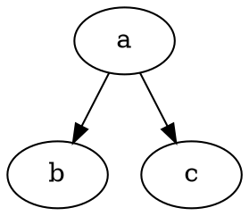
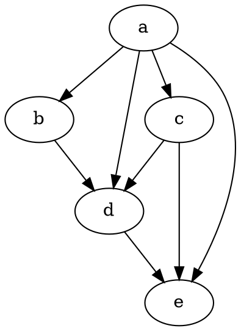
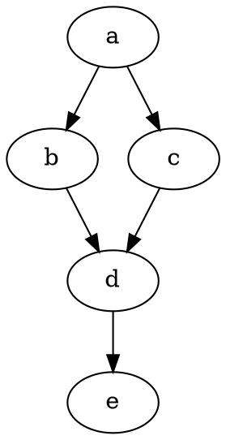

# Graph gallery

```dot
digraph g {
  a -> b;
  a -> c;
}
```

```dot
digraph g {
  a -> b;
  a -> c;
  a -> d;
  a -> e;
  b -> d;
  c -> d;
  c -> e;
  d -> e;
}
```

Transitive reduction of the graph above:

```dot
digraph g {
  a -> b;
  a -> c;
  b -> d;
  c -> d;
  d -> e;
}
```
