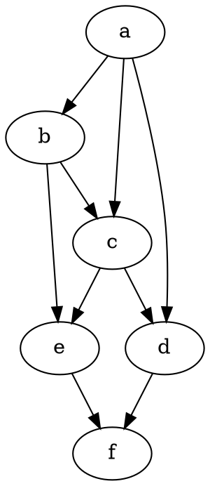

# Graph formulae

- `𝓖` graph
- `𝓥` set of vertices
- `𝓔` set of edges
- `ϕ` is an incidence function

- A graph is a pair comprised of the set of vertices and edges, `𝓖 = ⟨𝓥,𝓔⟩`
- A graph is an triple , `𝓖 = ⟨𝓥,𝓔,ϕ⟩`
- `ϕ` is an incidence function mapping every edge to an unordered pair (2-set) of vertices; that is, an edge is associated with two distinct vertices:   
`ϕ : 𝓔 -> { {A,B} | A,B ∈ 𝓥 ⋀ A ≠ B }`

- In a complete graph, with `v` as the number of vertices, the number of edges is `ε(v) = (v² - v) / 2`. A triangle of `n` is `Δn = (n² + n) / 2`

n |  ε |  Δ | n² | n²+n | n²-n |  n!
--|----|----|----|------|------|-----
1 |  0 |↙ 1 |  1 |   2  |  0   |   1
2 |  1 |↙ 3 |  4 |   6 ↘|↖ 2   |   2
3 |  3 |↙ 6 |  9 |  12 ↘|↖ 6   |   6
4 |  6↗| 10 | 16 |  20 ↘| 12   |  24
5 | 10↗| 15 | 25 |  30  | 20   | 120
6 | 15 | 21 | 36 |  42  | 30   | 720
7 | 21 | 28 | 49 |  56  | 42
8 | 28 | 36 | 64 |  72  | 56
9 | 36 | 45 | 81 |  90  | 72
10| 45 | 55 |100 | 110  | 90


```
ε(n) = (n² - n) / 2
Δ(n) = (n² + n) / 2
n² + n = 2Δ
n² - n = 2ε

Δ(n) = 0 + 1 + … + (n - 1) + n
ε(n) = 0 + 1 + … + (n - 1)
```


V = {A,B,C,D,E,F}

E = { {A,B}, {A,C}, {A,E},  }



