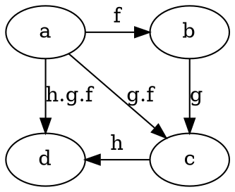

# Composition of functions

```
     f          g
           1 - - - -> x
a -------> 2 -------> x
b -------> 3 -------> y
           4 - - - -> y
𝒜          𝓑         𝒞
```

`f : A -> B` is an injective function (1:1), so it doesn't cover the whole codomain (an injection that does is a bijection).

A | B | C | g ∘ f
--|---|---|-------
_ | 1 | x |
a | 2 | x | a ⟼ x
b | 3 | y | b ⟼ y
_ | 4 | y |


`g : B -> C` is a surjection (onto), so it covers the while codomain but it is not 1:1, i.e. some elements in codomain are associated with more then one domain element, { 0 ⟼ w, 1 ⟼ w, 3 ⟼ y, 4 ⟼ y }.

However, the composition of `f` and `g` is bijective.

`f : A -> B` is *injective*, `g : B -> C` is *surjective*, but their composition `g ∘ f : A -> C` is *bijective*. Composition ignores some mappings from the common (middle) set `B`. Namely, it ignores `{ 1 ⟼ x, 4 ⟼ y }`, i.e. these 2 mappings are excluded.


## Composition


            ----f---> x
p ------> a ----g---> y
            ----h---> z


     f          g
a -------> 1 ------> x
b -------> 2 ------> y
c -------> 3 ------> y


     f          g
a -------> 1 ------> x
b -------> 2 ------> y
c -------> 3 ------> y


## Composability

Composition of functions is possible when the codomain of one function is the same as the domain of another, `cod(f) = dom(g)` => `∃h. h = g ∘ f`

```
      g ∘ f
a ------------> c
|               .
|               .
| f             . 1ᴄ
|               .
↓       g       .
b ------------> c


     f         g
a ------> b ------> c
a ----------------> c
        g ∘ f
```


## Associativity

Composition is associative: `h ∘ (g ∘ f)` = `(h ∘ g) ∘ f` = `h ∘ g ∘ f`



