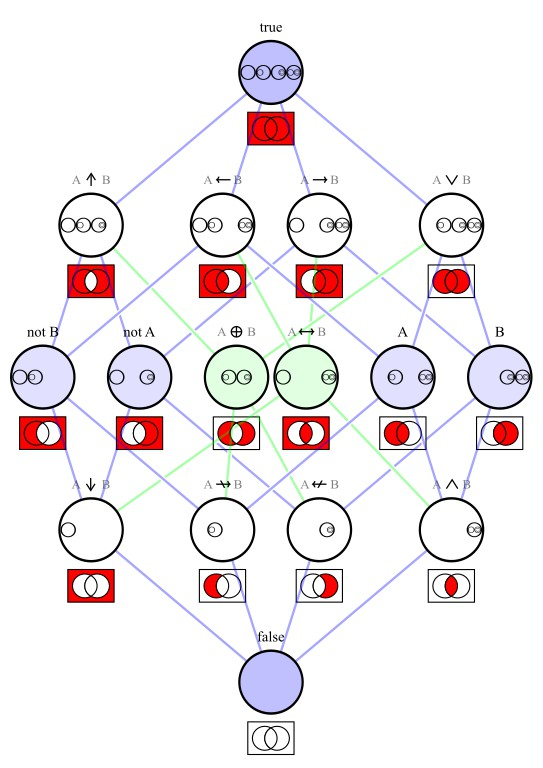

# Hasse diagram of binary logical connectives

The 16 binary logical connectives ordered in a Hasse diagram. 

They are represented by:
- logical formulas
- the 16 elements of `V₄ = P^4({})`
- Venn diagrams

The nodes are connected like the vertices of a 4 dimensional cube. 

The light blue edges form a rhombic dodecahedron - the convex hull of the tesseract's vertex-first shadow in 3 dimensions.
