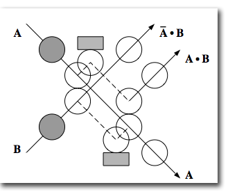

# Reversible computing

https://strangepaths.com/reversible-computation/2008/01/20/en/

*Computation* is the abstract representation of a physical process in terms of states, and transitions between states or events.

The definition of possible states and events is formulated in a *computation model*, such as the Turing machine or the finite automaton. For example, a Turing machine state is the complete sequence of symbols on its tape plus the head's position and internal symbol, and an event is the motion between two successive states, defined deterministically as a combination of read, write, move left and move right elementary motions.

In order to perform a computation, a robust mapping is first established between a computation model and a physical system, meaning that states and events in the model are used to label states and events observed in the system, and that the choosen correspondence is sufficiently stable in respect to various kinds of perturbations.

The system is then prepared in an initial state and is allowed to evolve through a path of events within the space of states, until it eventually reaches a state labeled as final. The discretized dynamics of the computational space may be represented with a directed graph, where nodes are possible states of the system and edges are events transforming a state into another.

## Logical reversibility

A function is said *reversible* (from latin revertere, 'to turn back') if, given its output, it is always possible to determine back its input, which is the case with bijections. If the space of states is finite, such a function is a *permutation*. Logical reversibility implies conservation of information.

When more then one input state is mapped onto the same output state, then the function is irreversible (and surjective), since it is impossible by only knowing the final state to find back the initial state.

In boolean algebra, NOT and ID are reversible, while other operations are irreversible. Two-argument boolean functions are irreversible, since they map `2²` input states into `2¹` output states such that information is lost in the merging of paths, i.e. *surjections are irreversable*.

## Physical reversibility

Known laws of physics are reversible. This is the case both of classical mechanics, based on lagrangian/hamiltonian dynamics, and of standard quantum mechanics, where closed systems evolve by unitary transformations, which are bijective and thus invertible.

As a consequence, when a physical system performs an irreversible computation, the computation model's mapping indicates that the computing system cannot stay closed.

More precisely, since an irreversible computation reduces the space of physical information-bearing states, then their entropy must decrease by increasing the entropy of the non-information bearing states, representing the thermal part of the system.

In 1961, Landauer studied this thermodynamical argument, and proposed the following principle: if a physical system performs a logically irreversible classical computation, then it must increase the entropy of the environment with an absolute minimum of heat release of `kT × ln(2)` per lost bit (where `k` is Boltzmann's constant and `T` the temperature, i.e. about 3×10-21 joules at room temperature), which emphasizes two facts:
- the logical irreversibility of a computation implies the physical irreversibility of the system performing it ("information is physical")
- logically reversible computations may be at least in principle intrinsically non-dissipative (which bears a relationship with Carnot's heat engine theorem, showing that the most efficient engines are reversible ones, and Clausius theorem, attributing zero entropy change to reversible processes)

## Reversible embedding of irreversible computations

Landauer further noticed that any irreversible computation may be transformed into a reversible one by embedding it into a larger computation where no information is lost, eg. by replicating every output in the input ('sources') and every input in the output ('sinks').

For example, the NAND irreversible function may be embedded in a bijection, i.e. in *the Toffoli gate*.

>toffoli : {c, a, b} → {(a ∧ b) ⊕ c, a, b}

(0, 0, 0 ) → (0, 0, 0) | (1,`0, 0`) → (`1`, 0, 0)
(0, 0, 1 ) → (0, 0, 1) | (1,`0, 1`) → (`1`, 0, 1)
(0, 1, 0 ) → (0, 1, 0) | (1,`1, 0`) → (`1`, 1, 0)
(0, 1, 1 ) → (1, 1, 1) | (1,`1, 1`) → (`0`, 1, 1)

The embedded original function (NAND) is highlighted.

The additional bits of information ensure that any computational path may be reversed: they are the garbage of the *forward path*, but the program of the *backwards path*. Instead of losing them in the environment, they are kept in the controlled computational space.

Toffoli gates are *universal reversible logic primitives*, meaning that any reversible function may be constructed in terms of Toffoli gates.

The *Fredkin gate* is another example of universal reversible logic primitive. It exchanges its two inputs depending on the state of a third, control input, thus allowing to embed any computation into a conditional routing of paths carrying conserved signals.

## Reversible computation models

The billiard-ball model, invented by Fredkin and Toffoli,4 was one of the first computation models focusing on implementation with reversible physical components. Based on the laws of classical mechanics, it is equivalent to the formalism of kinetic theory of perfect gases.

The presence of moving rigid spheres at specified points are defined as 1's, their absence as 0's. Interactions by means of right-angle collisions allow to construct various logic primitives, like for example the following 2-input, 3-output universal gate due to Feynman, who also proposed with Ressler a billiard-ball version of the Fredkin gate.

Feynman switch gate: B detects A without affecting its path

In practice, these computing spheres would be very unreliable, as instability arising from arbitrarily small perturbations would quickly generate chaotic deviations, producing an output saturated with errors.

The errors may be corrected (for example, by adding potentials to stabilize the paths), however the error correction process is itself irreversible and dissipative - since it has to erase the erroneous information.

Hence, error correction appears to be the only aspect of computation defining a lower bound to energy dissipation.

A stabler approach is that of the *Brownian computation model*, where thermal noise is on the contrary allowed to freely interact with a computing system near equilibrium. 

Potential energy barriers define the paths of a computational space, where the system walks randomly until it eventually reaches a final state. RNA polymerase, the enzyme involved in DNA transcription, is an example of a brownian logically reversible tape-copying machine. The DNA replication process also follows a similar mechanism, but adds a logically irreversible error-correcting step.

## Lecerf-Bennett reversal

The embedding method is however insufficient to build a physically reversible universal computer, since the growing amount of information needing to be replicated for each event would saturate any finite memory. Then, computation would come to an end - unless the memory would be irreversibly erased, but then dissipation would have been merely postponed, and not avoided.

This seemed to rule out the possibility of useful reversible computing machines, until a remarkable solution was found by Bennett (earlier work by Lecerf anticipated its formal method), showing that it is possible at least in principle to perform an unlimited amount of computation without any energy dissipation.

The reversible system shall compute the embedding function twice:
- the first time "forwards" to obtain and save the computation result, and
- the second time "backwards", as a mirror-image computation of the inverse function, de-computing the first step and returning the closed system to its initial state.

## Logical irreversibility and Maxwell's demon

In 1867 Maxwell devised a thought experiment involving a finite microscopic "demon" capable of observing the motion of individual molecules. This demon guards a small hole separating two containers, filled with gas at the same temperature. When a molecule approaches, the demon checks its speed and then opens or closes a shutter, so as slower molecules always go in one container (cooling it), and faster molecules go in the other (heating it), in apparent violation of the 2nd law of thermodynamics.

A first important step toward the solution of this controversial paradox was taken in 1929 by Szilard who, after avoiding dualistic traps by substituting the intelligent demon with a simple machine, suggested that proper accounting of entropy is restored in the process of measuring the molecule position. This explanation became the standard one until 1981, when *Bennett showed that the fundamentally dissipative step is surprisingly not the measurement (which can be done reversibly) but the logically irreversible erasure of demon's memory, to make room for new measurements*.

## Reversibility in quantum computation

Quantum computation takes advantage of the physical effects of superposition and entanglement, leading to a qualitatively new computation paradigm.

In quantum mechanical computation models, all events occur by *unitary transformations*, so that all quantum gates are reversible.

Quantum systems are less susceptible to certains kinds of errors affecting classical computations, since their discrete spectrum prevents trajectories from becoming chaotic, so that, e.g. quantum "billiard ball model" is more reliable than its classical counterpart.

However, quantum systems are also affected by new sources of error, as a consequence of interactions with the environment, such as *the loss of quantum coherence*. It is possible to correct generic quantum errors up to a limit, so as to reconstruct an error-free quantum state, at the price of performing an irreversible quantum erasure of the erroneous quantum information.
