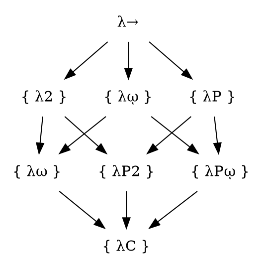

# Lambda Cube

https://en.wikipedia.org/wiki/Lambda_cube


```
         CoC


λP2        λP2        λPῳ


λ2        λῳ        λP


        STLC λ→
```


In mathematical logic and type theory, the λ-cube is a device, introduced by Henk Barendregt, to showcase the main contributing features that are added to the simply typed λ-calculus, on one end of the λ-cube, in order to turn it into the feature-full Calculus of Constructions (CoC), on the other end of the λ-cube.


- `λῳ`  
- `λP`  
- `λω`  
- `λP2` System U
- `λPῳ` 


n | Sym | Name                                | Ingrediants   | Sum
--|-----|-------------------------------------|---------------|-------
1 | λ→  | STLC         | →             |
2 | λ2  | System F                            | → ⨯ 2 = λ2    |
3 | λῳ  |                                     | → ⨯ ῳ = λῳ    |
4 | λP  |                                     | → ⨯ P = λP    |
5 | λω  |                                     | → + 2 + ῳ     | λ→ + λῳ + λP
6 | λP2 |                                     | → + P + 2     |
7 | λPῳ |                                     | → + P + ῳ     |
8 | λC  | CoC     | → + P + ῳ + 2 |


      0   1   2   4
LC  | → | ῳ | 2 | P |
----|---|---|---|---|
0
1
2
3
4
5
6
7


λ  | → | 2 | ῳ | P
---|---|---|---|---
λ→ | ✔ | ✘ | ✘ | ✘

λ  | → | 2 | ῳ | P
---|---|---|---|---
λ2 |   | ✔ | ✘ | ✘
λῳ |   | ✘ | ✔ | ✘
λP |   | ✘ | ✘ | ✔

λ  | → | 2 | ῳ | P
---|---|---|---|---
λω |   | 1 | 1 | 0
λP2|   | 1 | 0 | 1
λPῳ|   | 0 | 1 | 1

λ  | → | 2 | ῳ | P
---|---|---|---|---
λC | ✔ | ✔ | ✔ | ✔


1 ⨯ 1 ingr: STLC
3 ⨯ 2 ingr: 
3 ⨯ 3 ingr: 
1 ⨯ 4 ingr: COC





to investigate the different dimensions in which the calculus of constructions is a generalization of the simply typed λ-calculus.

Each dimension of the cube corresponds to a new kind of dependency between terms and types. Here, "dependency" refers to the capacity of a term or type to bind a term or type. The respective dimensions of the λ-cube correspond to:

x-axis ({\displaystyle \rightarrow }\rightarrow ): types that can bind terms, corresponding to dependent types.
y-axis ({\displaystyle \uparrow }\uparrow ): terms that can bind types, corresponding to polymorphism.
z-axis ({\displaystyle \nearrow }\nearrow ): types that can bind types, corresponding to (binding) type operators.
The different ways to combine these three dimensions yield the 8 vertices of the cube, each corresponding to a different kind of typed system. The λ-cube can be generalized into the concept of a pure type system.
