# Nondeterministic finite automaton

https://en.wikipedia.org/wiki/Nondeterministic_finite_automaton

https://www.youtube.com/watch?v=P5iWwYtwlwg

NFA introduces *ε-transitions*, i.e. transitions that consume no input char, i.e. consume the empty string, ε, thus their name.

It is a problem to construct a DFA D that recognizes a language that is a concat of two langs recognized by D1 and D2 respectivelly, so that D = D1 ∘ D2 (concat). We don't know where the first half of the string (processed by D1) should end to pass control to D2.

Nondeterministic behaviour comes from ε-transitions that are added to existing transitions that cover transitioning to another state on all inputs; thus, a state already has all transitions determined on some char, and we are adding ε transitions to that state - meaning there will be a choice in what transition to make. We can even have transitions to different states on the same symbol.

So, a NFA that recogizesd the concat of two languages, recognized by two DFA, can be made easily by removing the final states from D1 and having the ε transitions from those, ex final, states of D1 to the initial state of D2.

Thus, we cannot say directly that regular languages are closed under concat and star, cos we used NFA, but later we show that NFA and DFA are equivalent, and so regular langs are indeed closed under concat and star.

>Regular languages are closed under concat and star (due to the equivalence of NFAs and DFAs).

All DFAs have exactly one computation (transition) per symbol; a state has only one (deterministic) choice which transition to pick next on each symbol - all symbols are covered by each state. This is not the case with NFAs since there are ε transitions and we can leave some transitions out - a state may not have all transitions stated. Moreover, we can have different transition on the same symbol out of one state.

## ε closure

The smallest subset X of Q, X ⊆ Q, such that
- X containts the original set
- there is no ε transition from x ∈ X to y ∉ X

The "original set" is a set in terms of which we determine the ε closure. It may include one state, e.g. q₀, and then we add to it the states that can be reached from q₀ following ε transitions; e.g. `E({q₀})` = {q₁, q₂, q₃} = X, i.e. the ε closure of q₀ includes all states reachable from q₀ via *outgoing ε transitions*.

## Equivalence of DFA and NFA

`DFA ≅ NFA`

NFAs and DFAs are equivalent, as the *powerset construction* shows. The idea of powerset construction is that the DFA will "simulate" all possible choices that the NFA could make. We repeatedly take note of what states the NFA could be in at a given point, and "merge" them all into a single state. We repeat until no states have "unused" transitions in the DFA. 

## Conversion of NFA to DFA

Conversion of a NFA to DFA uses the powerset construction. The set of states of a NFA, Q -> 𝒫(Q), i.e. each new state is a subset of Q: Q' ⊆ Q, Q' ∈ 𝒫(Q).

### Example NFA

The NFA for `L = { w ∈ {0,1}⃰ | w contains substring 101 }`

```dot {engine="dot"}
digraph NFA {
  rankdir=LR;
  node [shape = doublecircle]; q₃;
  node [shape = circle];
  q₀ -> q₀ [ label = "0,1" ];
  q₀ -> q₁ [ label = "1" ];
  q₁ -> q₂ [ label = "0" ];
  q₂ -> q₃ [ label = "1" ];
  q₃ -> q₃ [ label = "0,1" ];
}
```

### DFA from NFA above

```dot {engine="dot"}
digraph DFA {
  rankdir=LR;
  node [shape = doublecircle]; r5; r4; r3;
  node [shape = circle];
  r0 [ label = "{q₀}" ];
  r1 [ label = "{q₀,q₁}" ];
  r2 [ label = "{q₀,q₂}" ];
  r3 [ label = "{q₀,q₁,q₃}" ];
  r4 [ label = "{q₀,q₂,q₃}" ];
  r5 [ label = "{q₀,q₃}" ];
  r0 -> r0 [ label = "0" ];
  r0 -> r1 [ label = "1" ];
  r1 -> r2 [ label = "0" ];
  r1 -> r1 [ label = "1" ];
  r2 -> r0 [ label = "0" ];
  r2 -> r3 [ label = "1" ];
  r3 -> r4 [ label = "0" ];
  r3 -> r3 [ label = "1" ];
  r4 -> r3 [ label = "0" ];
  r4 -> r5 [ label = "1" ];
  r5 -> r5 [ label = "0" ];
  r5 -> r3 [ label = "1" ];
}
```

### Conversion

Start with the initial state q₀ of D, make it into an initial set-state q₀ union its ε-closure. Then make new states of N as sets of states of D for each transition and pay attention to include ε-closures. The final states are those states in D that mention the final states in N.

Again, the NFA to DFA conversion via powerset construction: the idea is to take the ε-closure of the start state, and then repeatedly find "where to go" on each of the input symbols, always taking into account ε-closure of the resulting states. Then, the final states are the ones that include an originally final state in the NFA.

## Relation between a NFA converted from a DFA

It usually happens that the NFA has fewer states than the DFA, but it may also happen that they have the same number of states, or even than DFA has fewer states. So, anything can happen.

## Minimal NFAs are NOT Unique

We start with 2 NFAs that have the same structure but recognize different languages (have diff transitions).

The minimal NFAs are not unique. We show this by constructing the equivalent DFA for both of them, and that they produce the same DFA, meaning they have the same language. But they are not the same NFA, whereas minimal DFAs are always the same.

We convert each to a DFA and - it turns out we get the same exact DFA for both. Moreover, the resulting DFA is the most minimal possible.

>DFAs that are minimal are unique (structure-wise).

Two NFAs with no ε-transitions and with every single string having either one or zero computations - we can have multiple computations. The language is identical, the number of states is identical, but the number of computations for particular strings are different. NFAs are not necessarily unique even if you have the smallest possible NFA in terms of the number of states.

## NFA complement

We look at the question of complementing an NFA (i.e. switch all final and non-final states), and show that anything can happen. Either the resulting NFA accepts more strings, the right number of strings, or fewer strings than what is intended.
