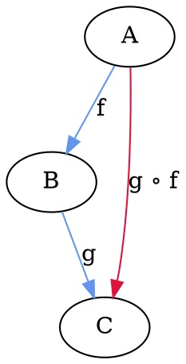

# Sets, Mappings and Composition

1. Abstract sets and mappings
  1.1 Sets, Mappings and Composition
  1.2 Listings, Properties, and Elements
  1.3 Surjective and Injective Mappings
  1.4 Associativity and Categories
  1.5 Separators and the Empty Set
  1.6 Generalized Elements
  1.7 Mappings as Properties

## 1.1 Sets, Mappings and Composition

An *abstract set* is supposed to have elements, each of which has no structure, and is itself supposed to have no internal structure, except that the elements can be distinguished as equal or unequal, and to have no external structure except for the number of elements. In the category of abstract sets, there occur sets of all possible sizes, including finite and infinite sizes. It has been said that an abstract set is like a mental "bag of dots", except that the bag has no shape.

What gives the category of sets its power is the concept of mapping. A mapping `f` from an abstract set `A` to an abstract set `B` is often explained through the use of the word "value" (however, since the elements of B have no structure, it'd be misleading to always think of these values as quantities).

Each mapping `f` from `A` to `B` satisfies:

> for each element `a` of `A`
> there is exactly one element `b` of `B`
> such that `b` is a value of `f` at `a`

This justifies the phrase "the value"; the value of `f` at `a` is usually denoted by `f(a)`, also denoting an element of `B` as `f(a)=b`. A mapping is single-valued and defined everywhere in its domain, and it has a definite codomain. Any `f` at all that satisfies this one property is considered to be a mapping from `A` to `B` in the category of abstract constant sets; that is why these mappings are referred to as "arbitrary".

A mapping is denoted by `f: A -> B`, where
- the domain of `f` is `A`, `dom(f) = A`
- the codomain of `f` is `B`, `cod(f) = B`
- the range of `f` is `R`, `R ⊆ B` and denoted by `ran(f) = R`, which is a subset of B comprised only of those elements of B that are actually associated.

Abstract sets and mappings are a *category*, which means above all that there is a composition of mappings: given any pair `f: A -> B`, `g: B -> C` there's a specified way of combining them to give a resulting mapping `g ∘ f : A -> C`.

A particular instance of composition can be pictured by an *external diagram* or *internal diagram*. External diagram is much more abstact, with the sets represented only as dots, while the internal diagram is very detailed, with every element and individual function's arrows clearly specified.

fig.1 External diagram
