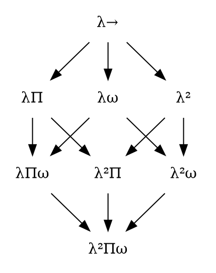

# Lambda Cube

https://en.wikipedia.org/wiki/Lambda_cube

- http://www.rbjones.com/rbjpub/logic/cl/tlc001.htm
- http://www.rbjones.com/rbjpub/logic/cl/tlc004.htm
- http://www.rbjones.com/rbjpub/philos/bibliog/b.htm#Barendregt

In mathematical logic and type theory, the λ-cube is a framework introduced by Henk Barendregt to investigate different dimensions in which the *calculus of constructions* is a generalization of the *simply typed λ-calculus*, `λ→`.

Each dimension of the cube corresponds to a new kind of dependency between terms and types. Here, "dependency" refers to the capacity of a term or type to bind a term or type.

The respective dimensions of the λ-cube correspond to:
* x-axis (→): types that can bind terms, corresponding to dependent types
* y-axis (↑): terms that can bind types, corresponding to polymorphism
* z-axis (↗): types that can bind types, corres. to (binding) type operators

[![Lambda_cube][pic]][link]

The different ways to combine these three dimensions yield the 8 vertices of the cube, each corresponding to a different kind of typed system. The λ-cube can be generalized into the concept of a pure type system.

- `λ→`  simply typed lambda calculus
- `λ2`  System F
- `λP`, `λΠ`
- `λω`
- `λfΠ`
- `λfω`  
- `λΠω`  
- `λfΠω`    higher-order dependently typed polymorphic lambda calculus

The calculus of constructions, `λC`, `λΠω`, `λPω`, `CC`, `CoC`

The λ-cube is a framework for exploring the axes of refinement in Thierry Coquand's calculus of constructions, starting from the *simply typed lambda calculus* (λ→) at the origin vertex of a cube, and the *calculus of constructions* (λfΠω), a higher-order dependently typed polymorphic lambda calculus, at its diametrically opposite vertex. Each axis of the cube represents a new form of abstraction.


$$\lambda \underline{\omega}$$

- Values depending on types, or polymorphism.   
  Second order lambda calculus (λf), System F, is obtained by imposing only this property.

- Types depending on types, or type operators.
  Simply typed lambda calculus with type operators
  (λω in the diagram) is obtained by imposing only this property.
  Combined with System F it yields System Fω (λω).

- Types depending on values, or dependent types.
  Imposing only this property yields λΠ 
  (written as λP in the diagram), 
  a type system closely related to LF.


---

Q: Does types being terms imply a dependend theory is polymorphic?
https://cs.stackexchange.com/a/19054

In the introduction of the book by B. Jacobs, `"Categorical Logic and Type Theory"`, he classifies type systems into 3 general flavours:
- Simply typed ones
- depended typed (term depended types)
- polymorphic types (type depended types)

He also stipulates that there are mixed types. Now if you start out with a Dependent Type Theory and introduce *transitive universes*, hence forcing types on the term level, are you automatically speaking of a polymorphic type system?

A: These 3 "flavors" are usually presented as the lambda cube. They aren't really flavors but properties that can be combined independently, so there are actually not 3 but 2³ = 8 flavors. In fact you could go as high as 4 properties yielding 2⁴ = 16 flavors:

1. terms depending on terms
  - `x -> x`
  - functional languages
2. terms depending on types
  - `τ -> x`
  - polymorphism
  - `head : forall τ. [τ] -> τ`
  - `head :: forall a. [a] -> a`
3. types depending on types: `τ -> τ`
  - type operators
  - `list : X ↦ [X]`
4. types depending on terms: `x -> τ`
  - dependent types
  - `array(int) : n ↦ int n`

```hs
succ :: Int -> Int
succ x = x + 1
-- quasi hs
s : ℕ -> ℕ
s = λn . n + 1
```


If you introduce transitive universes, then having types depending on terms automatically gives you types depending on higher-order terms, i.e. types.
The Barendregt cube tends to collapse when terms and types are collapsed. However this doesn't necessarily give you all the polymorphism you want. The Barendregt cube is a classification; it doesn't reflect all the properties of the language.
In particular, polymorphism can be more or less explicit, requiring you to thread type arguments down to every function, or not.
I think the right way to put it is that you're automatically speaking of a type system that can encode a polymorphic type system, but not necessarily give it to you the way you want.

---

What terms type systems exclude?
https://cs.stackexchange.com/a/49381

In the simply-typed lambda calculus, the type of a function must be fully specified, even when it's irrelevant. A trivial example is the identity function: in the lambda calculus, it's λx.x; in the simply-typed lambda calculus, there isn't a single identity function but rather a family of identity functions λx:T.x for every type T. This means that the simply-typed lambda calculus has no polymorphism. If you think about data structures, more concrete examples come up - you can't write, say, a generic function like list reversal, you have to write it all over again for each type of list elements. You can't even write basic primitives like nil and cons, only typed-indexed primitives nilT and consT.


```js

     λω ......... λPω

λ2 ......... λPf


     λϖ ......... λPϖ

λ→ ......... λP

```

λ-cube (direction of each arrow is direction of inclusion)

λΠϖ
λ→
λΠ


[link]: https://en.wikipedia.org/wiki/Lambda_cube
[pic]: https://upload.wikimedia.org/wikipedia/commons/1/19/Lambda_cube.png  "Lambda cube"

## Lambda cube

- λ-cube = { λ͢ , λ͢², λ͢ω̱, λ͢Π, λ͢²ω, λ͢²Π, λ͢Πω, λ͢²Πω }
- λ-cube = { λ͢ , λ², λω̱, λΠ, λ²ω, λ²Π, λΠω, λ²Πω }


