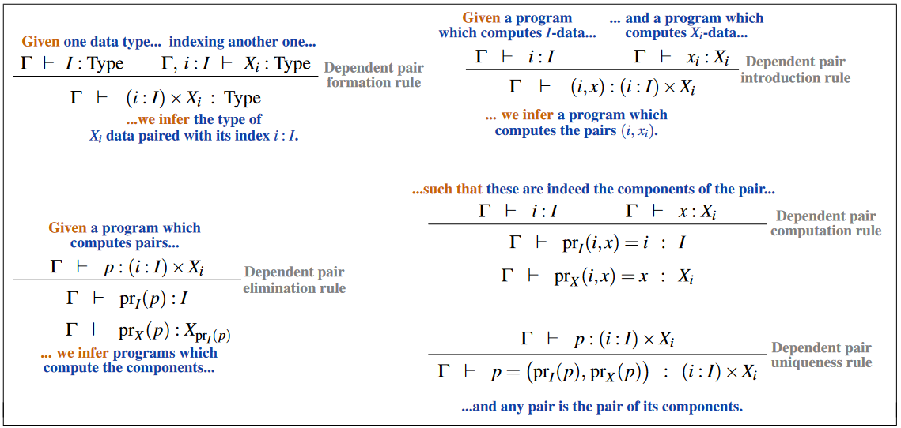

# Sigma types - dependent pairs

dependent pairs - inference rules:




sigma type: `Σ (a : A) B a`

```agda hs

-- given one type
-- indexing another type
-- we can infer the type of Xᵢ data
-- paired with its index i:I

Γ ⊢ I : Type    Γ, i : I ⊢ Xᵢ : Type
------------------------------------- Σ-f
Γ ⊢ (i : I) ⨯ Xᵢ : Type


-- Γ ⊢ I : Type    Γ, i : I ⊢ X i : Type
-------------------------------------- Σ-f
-- Γ ⊢ (i : I) ⨯ X i : Type


-- given a program which computes I-data
-- and a program which computes Xᵢ-data
-- we can infer a program
-- which computes the pairs (i, xᵢ)

Γ ⊢ i : I    Γ ⊢ xᵢ : Xᵢ
------------------------------------- Σ-i
Γ ⊢ (i, x) : (i, I) ⨯ Xᵢ

-- Γ ⊢ i : I    Γ ⊢ x i : X i
------------------------------------- Σ-i
-- Γ ⊢ (i, x) : (i, I) ⨯ X i


-- given a program which computes pairs
-- we can infer programs which computate
-- the pair's components

Γ ⊢ p : (i : I) ⨯ Xᵢ
------------------------------------- Σ-e
Γ ⊢ π₁ p : I
Γ ⊢ π₂ p : X (π₁ p)


```
