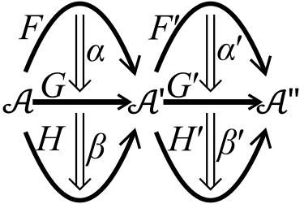

# Natural Transformation

https://en.wikipedia.org/wiki/Natural_transformation

A **natural transformation** (NT) maps one functor into another in a structure-preserving manner (i.e. by preserving the composition of morphisms and identities of the categories involved).

Hence, a NT may be considered as a morphism between functors.

Informally, the notion of a NT states that a particular mapping between two functors can be done consistently over an entire category. This intuition can be formalized to define *functor categories*.

NTs are, with categories and functors, one of the most fundamental notions of category theory and consequently appear in the majority of its applications.

## Contents

- 1. Definition
- 2. Examples
  - 2.1. Opposite group
  - 2.2. Modules
  - 2.3. Abelianization
  - 2.4. Hurewicz homomorphism
  - 2.5. Determinant
  - 2.6. Double dual of a vector space
  - 2.7. Finite calculus
  - 2.8. Tensor-hom adjunction
- 3. Unnatural isomorphism
  - 3.1. Example: fundamental group of torus
  - 3.2. Example: dual of a finite-dimensional vector space
- 4. Operations with natural transformations
  - 4.1. Vertical composition
  - 4.2. Horizontal composition
  - 4.3. Whiskering
  - 4.4. Interchange law
- 5. Functor categories
  - 5.1. More examples
- 6. Yoneda lemma
- 7. Historical notes


## 1. Definition

If F and G are functors between the categories C and D (both from C to D), then a natural transformation `η` from `F` to `G` is a *family of morphisms* that satisfies two requirements.

1. The natural transformation must associate, to every object `a` in C, a morphism `ηₐ : F(a) → G(a)` between objects of D. The morphism `ηₐ` is called *the component of `η` at `a`*.

2. Components must be such that for every morphism `f : a → b` in C we have:

>ηᵇ ∘ F(f) = G(f) ∘ ηᵃ

This condition can be expressed by the following commutative diagram, called the *naturality square*:

```
a           F a        ηₐ         G a
●            ● ─────────────────→ ●
│            │                    │
│            │     Naturality     │
│f       F f │                    │ G f
│            │       square       │
│            │                    │
↓            ↓                    ↓
●            ● ─────────────────→ ●
b           F a       ηᵇ          G b
```

>Naturality condition: `ηᵇ ∘ F f = G f ∘ ηᵃ`


If both F and G are contravariant, the vertical arrows in the diagram are reversed.

If `η` is a natural transformation from F to G, we write `η : F ⇒ G`.

This is also expressed by saying the family of morphisms `ηᵃ : F a → G a` is natural in `a`.

If, for every object `a` in C, the morphism `ηₐ` is an isomorphism in D, then `η` is said to be a *natural isomorphism* (or sometimes natural equivalence or isomorphism of functors).

Two functors F and G are called *naturally isomorphic* or simply isomorphic if there exists a natural isomorphism from F to G.

An *infranatural transformation* `η` from F to G is simply a family of morphisms `ηₐ : F a → G a`, for all `a` in C.

Thus, a *natural transformation* is an *infranatural transformation* for which `ηᵇ ∘ F f = G f ∘ ηᵃ`, for every morphism `f : a → b`.

The *naturalizer* of `η`, denoted `nat(η)`, is the largest subcategory of C containing all the objects of C on which `η` restricts to a natural transformation.


## 2. Examples

### 2.1. Opposite group
### 2.2. Modules
### 2.3. Abelianization
### 2.4. Hurewicz homomorphism
### 2.5. Determinant
### 2.6. Double dual of a vector space
### 2.7. Finite calculus
### 2.8. Tensor-hom adjunction


## 3. Unnatural isomorphism

The notion of a natural transformation is categorical, and states (informally) that a particular map between functors can be done consistently over an entire category.

Informally, a particular map (esp. an isomorphism) between individual objects (not entire categories) is referred to as a *natural isomorphism*, meaning implicitly that it is actually defined on the entire category, and defines a natural transformation of functors; formalizing this intuition was a motivating factor in the development of category theory. 

Conversely, a particular map between particular objects may be called an *unnatural isomorphism* (or "this isomorphism is not natural") if the map cannot be extended to a natural transformation on the entire category. 

Given an object `X`, a functor `G` (taking for simplicity the first functor to be the identity) and an isomorphism `η : X → G(X)`, proof of unnaturality is most easily shown by giving an *automorphism* `A : X → X` that does not commute with this isomorphism, so `η ∘ A ≠ G(A) ∘ η`. 

More strongly, if one wishes to prove that `X` and `G(X)` are not naturally isomorphic, without reference to a particular isomorphism, this requires showing that for any isomorphism `η`, there is some `A` with which it does not commute; in some cases a single automorphism `A` works for all candidate isomorphisms `η` while in other cases one must show how to construct a different `Aη` for each isomorphism. The maps of the category play a crucial role: any infranatural transform is natural if the only maps are the identity map, for instance.

This is similar (but more categorical) to concepts in group theory or module theory, where a given decomposition of an object into a direct sum is "not natural", or rather "not unique", as automorphisms exist that do not preserve the direct sum decomposition; see, for example [Structure theorem for finitely generated modules over a principal ideal domain § Uniqueness](https://en.wikipedia.org/wiki/Structure_theorem_for_finitely_generated_modules_over_a_principal_ideal_domain#Uniqueness)

Some authors distinguish notationally, using
- `≅` for a natural isomorphism
- `≈` for an unnatural isomorphism
- `=` for equality (usually equality of maps)

### 3.1. Example: fundamental group of torus

### 3.2. Example: dual of a finite-dimensional vector space

## 4. Operations with natural transformations

### 4.1 Vertical composition

- expressed with `∘`

If `η : F ⇒ G` and `ϵ : G ⇒ H` are NTs between functors `F,G,H : C → D`, then we can compose them to get a NT `ϵ ∘ η : F ⇒ H`. This is done componentwise:

>(ϵ ∘ η)ₐ = ϵₐ ∘ ηₐ

This vertical composition of NTs is associative and has an identity, and allows one to consider the collection of all functors `C → D` itself as a category (see Functor categories).

The identity NT `Iꜰ` on functor `F` has components `(Iꜰ)ₐ = Iꜰ(a)`.

For a NT `η : F ⇒ G`, identities hold: `Iɢ ∘ η = η = η ∘ Iꜰ`.


### 4.2 Horizontal composition

- expressed with `∗`

If `η : F ⇒ G` is a natural transformation between functors `F,G : C → D` and 
`ϵ : J ⇒ K` is a natural transformation between functors `J,K : D → E`, then the composition of functors allows a composition of natural transformations 

>ϵ ∗ η : (J ∘ F) ⇒ (K ∘ G)

with components

`(ϵ ∗ η)ₐ` = `ϵ G(a) ∘ J (ηₐ)` = `K (ηₐ) ∘ ϵ F(a)`

By using whiskering, we can write

`(ϵ ∗ η)ₐ` = `(ϵ G)ₐ ∘ (J η)ₐ` = `(K η)ₐ ∘ (ϵ F)ₐ`

hence

`ϵ ∗ η` = `ϵ G ∘ J η` = `K η ∘ ϵ F`


This horizontal composition of natural transformations is also associative with identity. This identity is the *identity natural transformation* on the *identity functor*, i.e., the natural transformation that associate to each object its identity morphism: for object `a` in category C, 

$(id_{id_C})ₐ = id_{id_C}(a) = idₐ$

For `η : F ⇒ G` with `F,G : C → D`, 

$id_{id_D} ∗ η = η = η ∗ id_{id_C}$

As identity functors `idᶜ` and `idᴰ` are functors,
>the identity for horizontal composition is also the identity for vertical composition, but not vice versa.


### 4.3 Whiskering

**Whiskering** is an external binary operation between a functor and a natural transformation.

https://proofwiki.org/wiki/Definition:Whiskering
https://ncatlab.org/nlab/show/whiskering

If `η : F ⇒ G` is a natural transformation between functors `F,G : C → D`, and `H : D → E` is another functor, then we can form the NT `Hη : H ∘ F ⇒ H ∘ G` by defining `(Hη)ₐ = H(ηₐ)`.

If on the other hand `K : B → C` is a functor, the NT `ηK : F ∘ K ⇒ G ∘ K` is defined by `(ηK)ₐ = ηK(a)`.


It's also a horizontal composition where one of the natural transformations is the identity natural transformation:

`Hη = Iᴴ ∗ η` and `ηK = η ∗ Iᴷ`

Note that `Iᴴ` (resp. `Iᴷ`) is generally not the left (resp. right) identity of horizontal composition `∗`, i.e. `Hη ≠ η` and `ηK ≠ η` in general, except if `H` (resp. `K`) is the identity functor of the category D (resp. C).


### 4.4 Interchange law

The two operations are related by an identity which exchanges vertical composition with horizontal composition: 

if we have 4 natural transformations `α,α′,β,β′` (as shown in the image below), then the following identity holds:

>(β′ ∘ α′) ∗ (β ∘ α) = (β′ ∗ β) ∘ (α′ ∗ α)




Vertical and horizontal compositions are also linked through *identity natural transformations*: for F : C → D and G : D → E, `Iᴳ ∗ Iᶠ = Iᴳ ∘ F`.


As whiskering is horizontal composition with an identity, the interchange law gives immediately the compact formulas of horizontal composition of `η:F⇒G` and `ϵ:J⇒K` without having to analyze components and the commutative diagram:

```
ϵ ∗ η = (ϵ ∘ Iᴶ) ∗ (Iᴳ ∘ η)
      = (ϵ ∗ Iᴳ) ∘ (Iᴶ ∗ η)
      = ϵ G ∘ J η
      = (Iᴷ ∘ ϵ) ∗ (η ∘ Iꜰ)
      = (Iᴷ ∗ η) ∘ (ϵ ∗ Iꜰ)
      = K η ∘ ϵ F
```


## 5. Functor categories

https://en.wikipedia.org/wiki/Functor_category


### 5.1. More examples


## 6. Yoneda lemma


## 7. Historical notes
