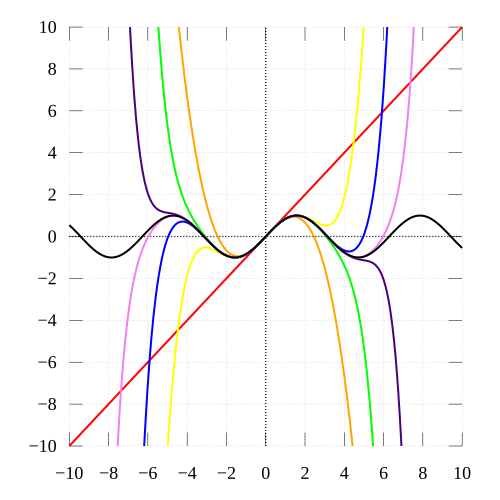

# cos as Taylor series

## Taylor expansion of cos

See it in action on desmos
https://www.desmos.com/calculator/1rke30q0km

Expansion of `cos(x)` as a power series:

```js
         ⎲∞         x²ⁿ          x²     x⁴     x⁶     x⁸     x¹⁰    x¹²
cos(x) = ⎳ₙ₌₀ (-1)ⁿ ----  = 1 - ---- + ---- - ---- + ---- - ---- + ---- - …
                      n!          2!      4!     6!     8!    10!    12!
```

Some functions, including many trig function, primarily sin and cos, have Taylor series which mentions no derivatives, just powers. Their representations in sigma notation do not seem to rely on derivatives, so are these really Taylor series?

A *Taylor series* (or Taylor expansion) of a function is an infinite sum of terms that are *expressed in terms of the function's derivatives* at a single point, `a`.

```js
⎲∞   f⁽ⁿ⁾(a)                              f′′(a)           f′′′(a)
⎳ₙ₌₀ ------- (x-a)ⁿ = f(a) + f′(a)(x-a) + ------ (x-a)² + ------ (x-a)³ + …
        n!                                  2!              3!
```

There is a single, central point, namely zero (`a=0`), though, around which the expanded terms accurately represent the target function (but no derivatives). The definition of Taylor series suggests that the second term is a 


## Taylor expansion of sin



Taylor approximations of `sin(x)` which are polynomials of degree
- 1 red: linear, `y = x` (identity diagonal)
- 3 orange: cubic, `y = x-1⁄6x³`
- 5 yellow
- 7 green
- 9 blue
- 11 violet-ish
- 13 pink-ish

Even degrees add no fidelity because `sin(a) = 0`, since `a = 0`.

As the degree of the Taylor polynomial rises, it approaches the correct values of `sin` function.
