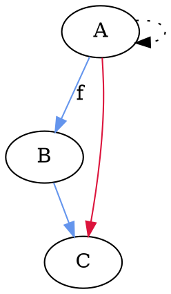
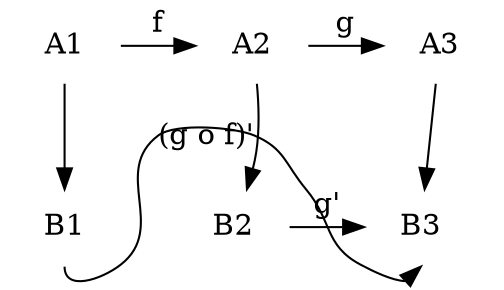
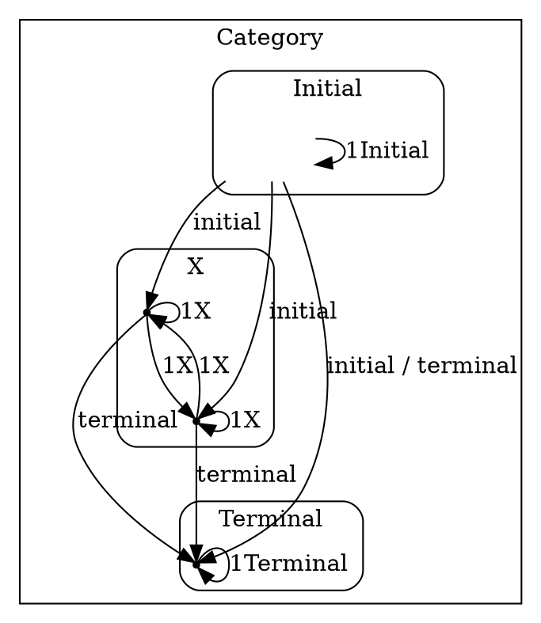

# Sets, maps, composition

Before giving a precise definition of category, we should become familiar with one example, *the category of finite sets and maps*.

An *object* in this category is a finite set or collection.

A *map* `f` in this category consists of 3 things:
1. set `A`, called the *domain of the map*
2. set `B`, called the *codomain of the map*
3. *rule* assigning to each element `a ∈ A` an element `b ∈ B` denoted and determined by `f(a) = b`

