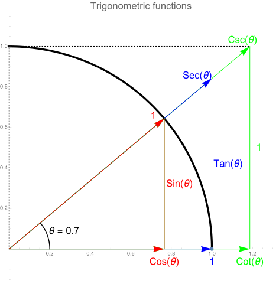
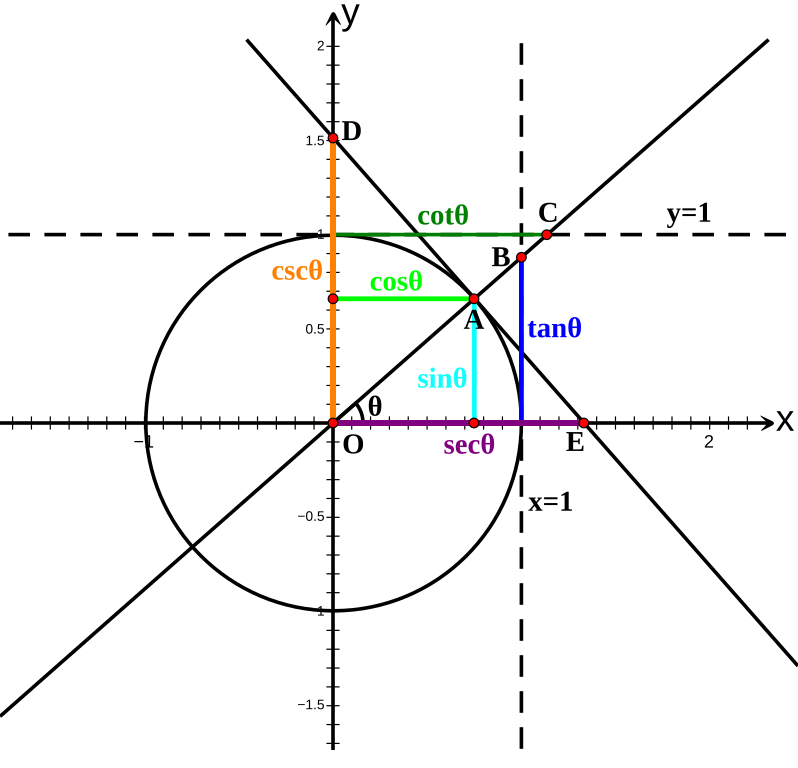
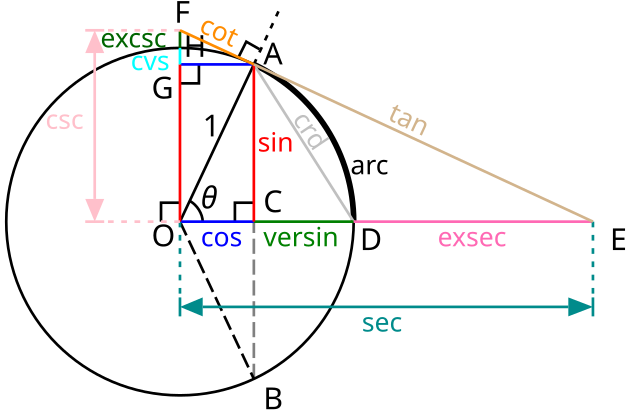
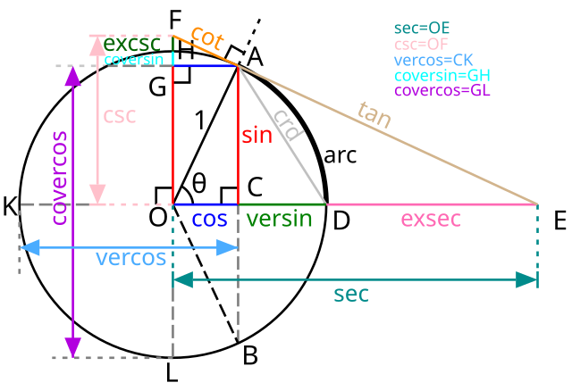

# Trigonometric functions :: Diagrams

https://en.wikipedia.org/wiki/Trigonometric_function

Plot of the 6 trig fns on the unit circle with θ = 0.7 radians. The points labeled 1, `Sec(θ)`, `Csc(θ)` represent the length of the line segment from the origin to that point. `Sin(θ)`, `Tan(θ)`, and 1 are the heights to the line starting from the x-axis, while `Cos(θ)`, 1, and `Cot(θ)` are lengths along the x-axis starting from the origin.

In this illustration, the six trigonometric functions of an arbitrary angle θ are represented as Cartesian coordinates of points related to the unit circle. The y-axis ordinates of A, B and D are sin θ, tan θ and csc θ, respectively, while the x-axis abscissas of A, C and E are cos θ, cot θ and sec θ, respectively.

This is a graphical construction of the various trigonometric functions from a chord `AD` (angle θ) of the unit circle centered at `O`. In addition to the modern trigonometric functions sin, cos, tan, cot, sec, and csc, the diagram also includes a few obsolete: chord (crd), versin (versine or versed sine), exsec (exsecant), cvs (coversine), and excsc (excosecant).

