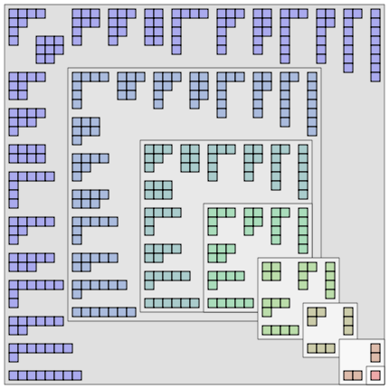
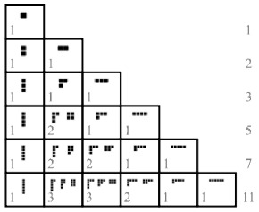

# Partition

https://en.wikipedia.org/wiki/Integer_partition
https://en.wikipedia.org/wiki/Partition_(number_theory)

In number theory and combinatorics, a **partition** of a positive integer `n`, also called an *integer partition*, is a way of writing `n` as a sum of positive integers.

Two sums that differ only in the order of their summands are considered the same partition. If the order matters, the sum becomes a *composition*.

For example, 4 can be partitioned in 5 distinct ways:

```
4
3 + 1
2 + 2
2 + 1 + 1
1 + 1 + 1 + 1
```

The order-dependent composition 1 + 3 is the same partition as 3 + 1, and the two distinct compositions 1 + 2 + 1 and 1 + 1 + 2 represent the same partition 2 + 1 + 1.

A *summand* in a partition is also called a *part*. The number of partitions of `n` is given by the *partition function* `p(n)`. So `p(4) = 5`.

The notation `λ ⊢ n` means that `λ` is a partition of `n`.

Partitions can be graphically visualized with *Young diagrams* or *Ferrers diagrams*. They occur in a number of branches of mathematics, including the study of symmetric polynomials and of the symmetric group and in group representation theory in general.




Young diagrams associated to the partitions of the positive integers 1 through 8. They are arranged so that images under the reflection about the main diagonal of the square are conjugate partitions.




Partitions of `n` with biggest addend `k`


## Contents

- 1. Examples
- 2. Representations of partitions
  - 2.1. Ferrers diagram
  - 2.2. Young diagram
- 3. Partition function
- 4. Restricted partitions
  - 4.1. Conjugate and self-conjugate partitions
  - 4.2. Odd parts and distinct parts
  - 4.3. Restricted part size or number of parts
    - 4.3.1. Asymptotics
  - 4.4. Partitions in a rectangle and Gaussian binomial coefficients
- 5. Rank and Durfee square
- 6. Young's lattice

## Examples

The 7 partitions of 5 are:

```
5
4 + 1
3 + 2
3 + 1 + 1
2 + 2 + 1
2 + 1 + 1 + 1
1 + 1 + 1 + 1 + 1
```

Some authors treat partitions as the sequence of summands, rather than as an expression with plus signs. For example, the partition 2 + 2 + 1 might instead be written as the tuple (2, 2, 1) or in the even more compact form (2², 1) where the superscript indicates the number of repetitions of a part.

## Representations of partitions

There are two common diagrammatic methods to represent partitions: as Ferrers diagrams, named after Norman Macleod Ferrers, and as Young diagrams, named after the British mathematician Alfred Young. Both have several possible conventions; here, we use English notation, with diagrams aligned in the upper-left corner.

### Ferrers diagram

The partition 6 + 4 + 3 + 1 of the number 14 can be represented by the following diagram:

```
o o o o o o
o o o o
o o o
o
```

The 14 circles are lined up in 4 rows, each having the size of a part of the partition. The diagrams for the 5 partitions of the number 4 are shown below:

```
4        = 3 + 1   = 2 + 2   = 2 + 1 + 1    = 1 + 1 + 1 + 1
o o o o    o o o     o o       o o            o
           o         o o       o              o
                               o              o
                                              o
```

## Young diagram

An alternative visual representation of an integer partition is its Young diagram (often also called a Ferrers diagram). Rather than representing a partition with dots, as in the Ferrers diagram, the Young diagram uses boxes or squares. Thus, the Young diagram for the partition 5 + 4 + 1 is

```
┌───┬───┬───┬───┬───┐
│   │   │   │   │   │
├───┼───┼───┼───┼───┘
│   │   │   │   │
├───┼───┴───┴───┘
│   │
└───┘
```

while the Ferrers diagram for the same partition is

```
o o o o o
o o o o
o
```

While this seemingly trivial variation does not appear worthy of separate mention, Young diagrams turn out to be extremely useful in the study of *symmetric functions* and *group representation theory*: filling the boxes of Young diagrams with numbers (or sometimes more complicated objects) obeying various rules leads to a family of objects called *Young tableaux*, and these tableaux have combinatorial and representation-theoretic significance. As a type of shape made by adjacent squares joined together, Young diagrams are a special kind of *polyomino*.

## Partition function

The partition function `p(n)` equals the number of possible partitions of a non-negative integer `n`. For instance, `p(4)=5` because the integer 4 has the 5 partitions 1+1+1+1, 1+1+2, 1+3, 2+2, and 4.

The values of this function for `n=0,1,2,…` make the OEIS sequence A000041:

1, 1, 2, 3, 5, 7, 11, 15, 22, 30, 42, 56, 77, 101, 135, 176, 231, 297, 385, 490, 627, 792, 1002, 1255, 1575, 1958, 2436, 3010, 3718, 4565, 5604, ...
