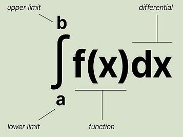

# Integral

A definite integral is the most similar to the sigma notation. The symbol used in sigma notation, `Σ`, and the symbol used in integration, `⎰`, are both variants of "s" that stands for summation.

In a summation, the number of times the addition is performed is explicitly indicated as the upper bound, `n` (or, more generally, as the difference between the upper and lower bound). In fact, even in the sigma notation, we can put `∞` as the upper bound, making it even closer to a definite integral.





Integration of function `f(x)` over an interval [a,b]

```
⌠ᵇ
⌡ₐ f(x)dx
```

An interval consists of two endpoints, bounds, lower and upper.
- `a` and `b` are called *bounds of integration*
- `a` is the lower bound of integration
- `b` is the upper bound of integration
- `a` and `b` are points that define the interval from `a` to `b`

The interval may be:
- closed,      `[a, b]`
- open,        `(-∞, ∞)`
- half-open,   `(-∞, b]`
- half-closed, `[a, ∞)`

Infinity (`±∞`) as an endpoint in an interval is never included (closed over).


Whereas we use *derivatives* in calculus to compute instantaneous rates of change of functions, *integrals* measure net change or total change of functions over an interval.

For example, if you were driving along an interstate highway and you had a function `f(t)` that measured the distance (in miles) from your starting location as a function of the time `t` (in hours) since you started driving, then the integral `₂∫⁴ f(t) d⁡t` would represent the total distance traveled between hours 2 and 4 of your trip.

Integrals are used throughout physics, engineering, and math to compute quantities such as area, volume, mass, physical work, and more.

- basics behind integrals
- difference between definite and indefinite integrals
- basic strategies for computing integrals

In general, a *definite integral* looks like this, `₂∫⁴ f(t) d⁡t`, i.e. it has bounds, while *indefinite integral* does not. The definite integral therefore gives a number as a result, while indefinite gives a function.

Indefinite integrals arise from the way that we typically compute definite integrals. Most of the time, we evaluate definite integrals using the *Fundamental Theorem of Calculus* (FTC):

    ₐ∫ᵇ f(x)dx = F(b) − F(a) where F′(x) = f(x)

In words, to evaluate the integral of a function `f` over an interval `a≤x≤b`, we need to find a function `F` whose derivative is `f`; evaluate that function at the two endpoints of the interval; and then subtract those two values. For example, to compute an integral of the function `f(x)=x²`, we could use the function `F(x) = 1/3`, since the derivative of the latter is `x²`:

    ₁∫³ x² d⁡x = 1/3(3)³ - 1/3(1)³ = 26/3

The function `F` used in the FTC is called an antiderivative of `f`: it is a function whose derivative is `f`. This is where indefinite integrals come in: we use the notation

    ∫ f(x) dx

for the general *antiderivative* of `f`. Based on example above, we would have

    ∫ x² dx = 1/3x³ + C

where the extra constant `+ C` term is there to take into account all of the functions whose derivative are `x²`.

In summary: definite integrals - those with bounds - are extremely useful for computing areas and net changes of functions, and we can extend them to compute other quantities, such as mass and volume. To actually evaluate a definite integral, however, we need to find an indefinite integral (antiderivative).

## Integrals of Common Functions

- Integrals of Power Functions
- Integrals of Exponential and Logarithmic Functions
- Integrals of Trigonometric Functions

Because `eˣ` is its own derivative, it is also its own antiderivative.

Name          | Fn       | Derivative ∫ f(x) dx
--------------|----------|--------------------
const         | c        | cx + C
id            | x        | 1/2x² + C
square        | x²       | 1/3x³ + C
cube          | x³       | 1/4x⁴ + C
sqroot        | √x       | 2/3x^(3/2) + C
reciprocal    | x⁻¹      | ln |x| + C
exponential   | eˣ       | eˣ + C
gen. exponent | aˣ       | aˣ/(ln a) + C
nat log       | ln x     | x ln x - x + C
sine          | sin x    | -cos x
cosine        | cos x    | sin x
tangent       | tan x    | ln |cos x|
surprise      | 1/(1+x²) | arctan x + C


## Integration Rules

Just like derivatives, there's a "Power Rule" for integrals.

### The Power Rule

The Power Rule for integrals is something of an opposite to the usual Power Rule for differentiation:

    ∫xᵏdx = xᵏᐩ¹/(k+1) + C

Notice that this doesn't work if `k = −1`, since then we have division by zero on the right side of the equation.

### The Sum, Difference, and Constant Multiple Rules

Because derivatives and integrals are closely related, they obey some similar algebraic properties. In particular, integrals follow the same rules regarding sums, differences, and constant multiples of functions.

    ∫ (f(x) + g(x)) dx = ∫ f(x) dx + ∫ g(x) dx
    ∫ (f(x) - g(x)) dx = ∫ f(x) dx - ∫ g(x) dx
    ∫ c f(x) dx = c ∫ f(x) dx

### Integration by Substitution

This is probably the most useful rule for computing integrals, even though it takes some time to master it. On paper, the formula for substitution is, once again, an opposite of sorts, this time to the Chain Rule for derivatives:

    ∫ f′(u(x)) u′(x) dx = f(u(x)) + C

We can apply substitution to an integral whenever we can identify a piece `(u(x))` of the integrand whose derivative `u′(x)` also appears in the integrand.

Let's work through an example to see how this goes.

    ∫ 2x eˣ dx

Notice that the *integrand* `2x eˣ` fits the criterion for using substitution: if we define `u(x)=x²`, then the derivative `u′(x) = 2x` also appears in the integrand. So we substitute `u = x²` into this integral. We replace `x²` with `u` and `2xdx` with `du`:

    ∫ 2x (eˣ)² dx → ∫ eᵘ du

This leaves us with a simpler integral that we can compute:

    ∫ eᵘ du = eᵘ + C

To finish the process, we plug `u = x²` back into the antiderivative we found:

    ∫ 2x (eˣ)² dx = (eˣ)2 + C

Remember, the goal with integrals is to find functions whose derivatives are the functions we are given. So we can always check our work by taking the derivative of our result via the Chain Rule, to see if we get the function we started with.


## Links

https://articles.outlier.org/a-beginners-guide-to-integrals
