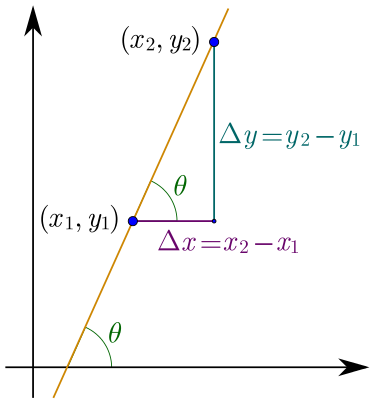

# Slope

https://en.wikipedia.org/wiki/Slope

>The **slope** (gradient) of a line is a number that describes both the direction and the steepness of the line.

(how can it describe direction!? since when lines have direction?!)

Slope is often denoted by the letter `m`. 
The equation of straight line: `y = mx + b`.


>The slope is calculated by finding the ratio of vertical to horizontal change (rise over run) between any two distinct points on a line.





Sometimes *the ratio* is expressed as a *quotient*, rise over run, giving the same number for every two distinct points on the same line.

A line that is decreasing has a negative "rise".

```
rise
---- = ratio
run
```

Slope affects a line's grade and direction.

The **grade of a line** (steepness, incline) is measured by the absolute value of the slope. A slope with a greater absolute value indicates a steeper line. 

The **direction of a line** is:
- line is *increasing* if it goes *up* from left to right; slope `m > 0`
- line is *decreasing* if it goes *down* from left to right; slope `m < 0`
- if a line is *horizontal*, slope `m = 0` (constant function)
- if a line is *vertical* the slope is `m = undefined`

slope         | line                                     | line equation
--------------|------------------------------------------|---------------
m > 0         | increasing, goes UP from left to right   | y = +mx + b
m < 0         | decreasing, goes DOWN from left to right | y = -mx + b
m = 0         | horizontal                               | y = b
m = undefined | vertical                                 | m → ±∞

y = mx + b
- `b` affects a line's position (offset)
- slope, `m`, affects a line's steepness and direction
- if slope m = 0 then y = b
- if slope m > 0 then y = +mx + b
- if slope m < 0 then y = -mx + b
- line gets close to being vertical as slope tends to ±infinity, `m → ±∞`


For example, the rise of a road between two points is the *difference in the altitudes* of the road at those two points, i.e. **rise** is `Δy = (y₂ − y₁)`.

For relatively short distances, where the Earth's curvature may be neglected, the **run** is the *difference in distance* from a fixed point measured along a level, horizontal line, i.e. the run is `Δx = (x₂ − x₁)`.

Here the slope of the road between the two points is simply described as the ratio of the altitude change to the horizontal distance between any two points on the line.
